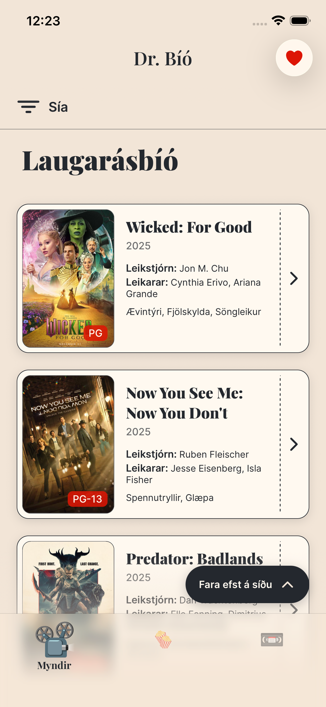
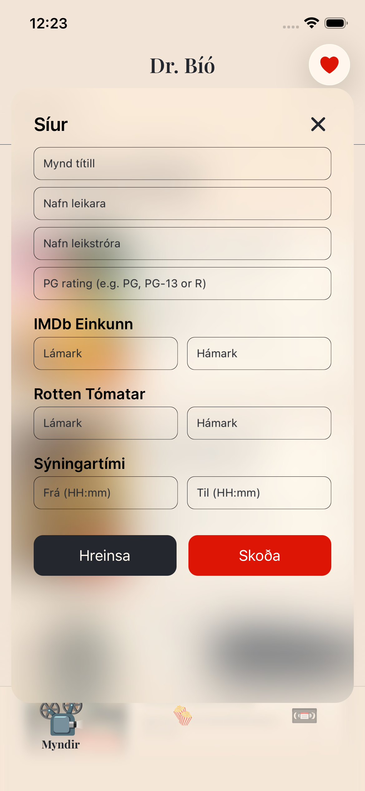
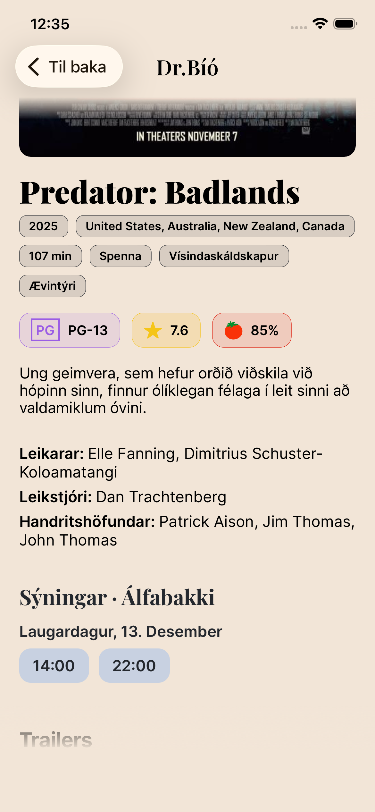
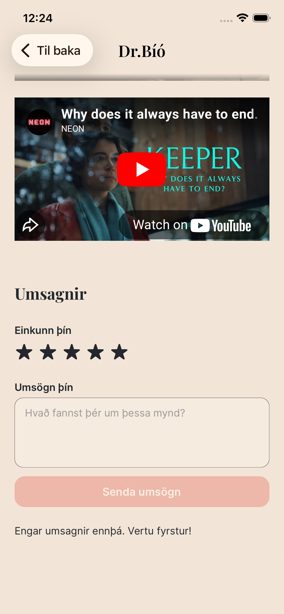
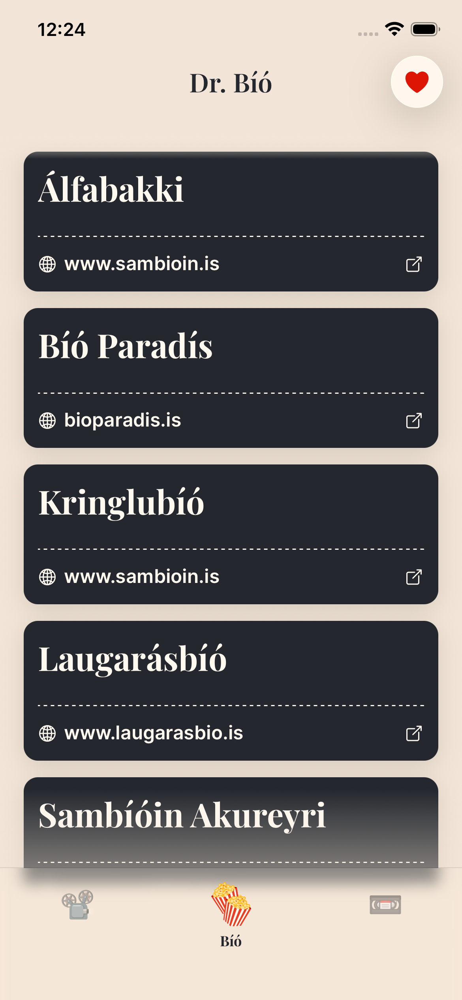
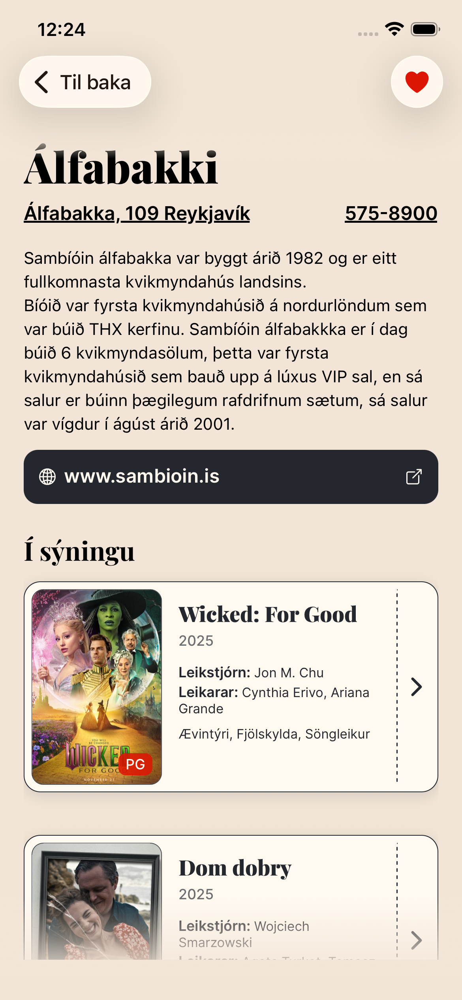
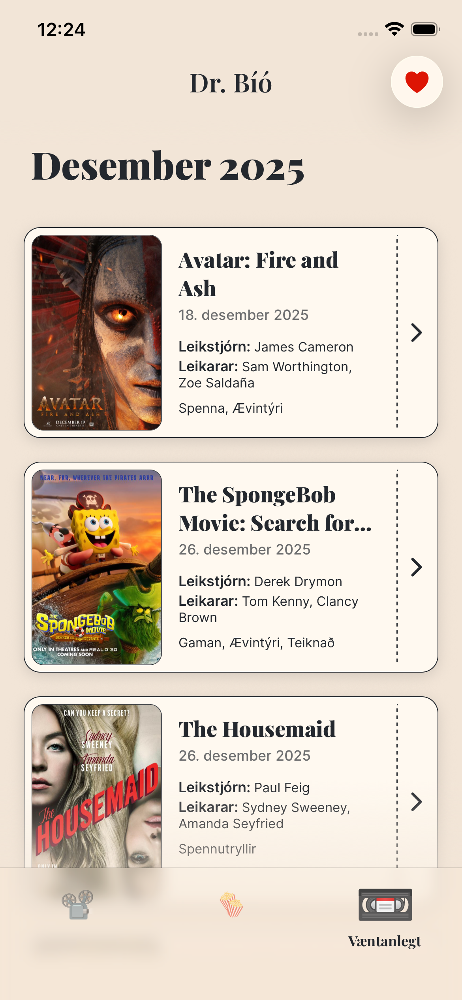
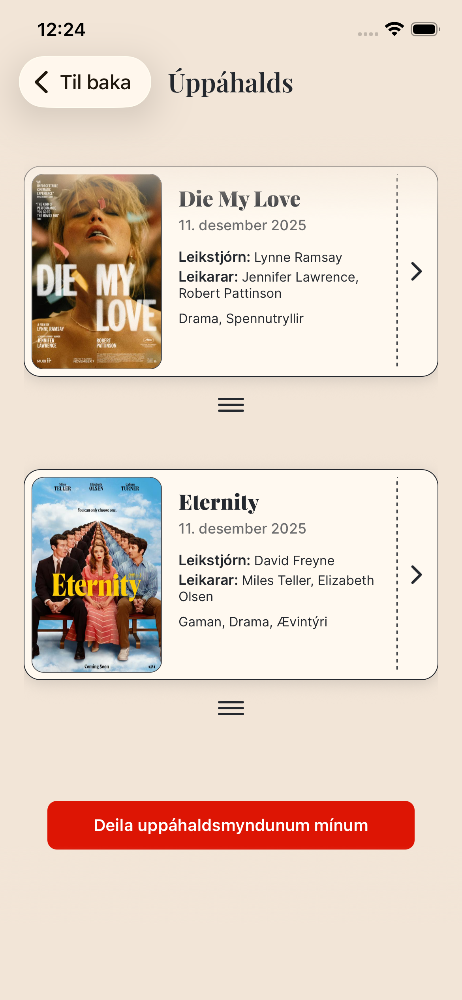

# Dr. Cinema

Dr. Cinema is a mobile application that allows users to browse currently showing and upcoming movies in Icelandic cinemas, view detailed movie and cinema information, manage favorites, and leave reviews.

This repository contains the application developed for Assignment 2 in the App Development course at Reykjavík University. The course covers key topics in modern app development, including React Native, ES6, Expo, development environments, app publishing, Redux, and more.

## Table of Contents

- [Project Structure](#project-structure)
- [Prerequisites](#prerequisites)
- [Installation Guide](#installation-guide)
  - [Clone the Repository](#1-clone-the-repository)
  - [Go Into the repository](#2-go-into-the-repository)
  - [Install Depedencies](#3-install-dependencies)
  - [Add API Credentials](#4-add-api-credentials)
- [Running the Application Guide](#running-the-application-guide)
- [Primary Development Platform](#primary-development-platform)
- [Features](#features)
- [Screenshots](#screenshots)
- [Collaborators](#collaborators)

## Project Structure

``` bash
.
├── README.md
├── app.config.js
├── declarations.d.ts
├── docs
│   ├── prototype_drawing_1.jpeg
│   ├── prototype_drawing_2.jpeg
│   └── prototype_drawing_3.jpeg
├── eslint.config.js
├── expo-router.config.js
├── jest.config.js
├── metro.config.js
├── package-lock.json
├── package.json
├── screenshots
│   ├── screenshot_1.png
│   ├── screenshot_2.png
│   ├── screenshot_3.png
│   ├── screenshot_4.png
│   ├── screenshot_5.png
│   ├── screenshot_6.png
│   ├── screenshot_7.png
│   └── screenshot_8.png
├── src
│   ├── app
│   │   ├── (tabs)
│   │   │   ├── _layout.tsx
│   │   │   ├── index.tsx
│   │   │   ├── theaters
│   │   │   │   └── index.tsx
│   │   │   └── upcoming
│   │   │       └── index.tsx
│   │   ├── _layout.tsx
│   │   ├── favorites
│   │   │   └── index.tsx
│   │   ├── movie_details
│   │   │   └── index.tsx
│   │   └── theater_details
│   │       └── index.tsx
│   ├── assets
│   │   ├── icons
│   │   │   ├── cassette_icon.svg
│   │   │   ├── popcorn_icon.svg
│   │   │   ├── projector_icon.svg
│   │   │   └── rotten_tomatoes.svg
│   │   └── images
│   │       ├── favicon.svg
│   │       ├── icon.png
│   │       └── splash-icon.png
│   ├── components
│   │   ├── ui
│   │   │   ├── movie_card.tsx
│   │   │   ├── movie_details
│   │   │   │   ├── favorite_button.tsx
│   │   │   │   ├── movie_info.tsx
│   │   │   │   ├── movie_review.tsx
│   │   │   │   ├── share_button.tsx
│   │   │   │   ├── theater_showtimes.tsx
│   │   │   │   └── trailers_list.tsx
│   │   │   ├── movie_filters.tsx
│   │   │   ├── scroll_to_top_button.tsx
│   │   │   ├── theater_card.tsx
│   │   │   └── theater_website_link.tsx
│   │   └── views
│   │       ├── favorites_view.tsx
│   │       ├── home_view.tsx
│   │       ├── movie_details_view.tsx
│   │       ├── theater_details_view.tsx
│   │       ├── theaters_view.tsx
│   │       └── upcoming_view.tsx
│   ├── constants
│   │   └── theme.ts
│   ├── services
│   │   ├── api.ts
│   │   ├── current_movie_service.ts
│   │   ├── movie_details.ts
│   │   ├── theaters_service.ts
│   │   ├── upcoming_movie_details.ts
│   │   └── upcoming_movies_service.ts
│   ├── store
│   │   ├── current_movie_details_slice.ts
│   │   ├── current_movie_slice.ts
│   │   ├── favorites_slice.ts
│   │   ├── hooks.ts
│   │   ├── index.ts
│   │   ├── reviews_slice.ts
│   │   ├── theaters_slice.ts
│   │   ├── upcoming_movie_details_slice.ts
│   │   └── upcoming_movies_slice.ts
│   ├── types
│   │   ├── movie.ts
│   │   └── theatre.ts
│   └── utils
│       ├── date_formatter.ts
│       ├── favorite_movies.ts
│       ├── filter_theater.ts
│       ├── filter_upcoming.ts
│       ├── get_type.ts
│       ├── linking.ts
│       ├── movie_dedupe.ts
│       ├── movie_filtering.ts
│       ├── movie_group.ts
│       ├── movie_sort.ts
│       └── share_favorites.ts
└── tsconfig.json
```

## Prerequisites

- Node.js (v14 or higher)
- npm
- React Native CLI
- Xcode (for iOS development)

## Installation Guide

### 1. Clone the Repository

Open your terminal and clone the repository into a desired directory.

```bash
git clone https://github.com/guiroquue/Dr-Cinema.git
```

### 2. Go Into the Repository

Inside the terminal, travel into the repository.

```bash
cd Dr-Cinema
```

### 3. Install Dependencies

Install the required dependencies with the node package manager.

```bash
npm install
```

### 4. Add API Credentials

Before running the app, create an **.env** file in the project root and add your Kvikmyndir API credentials.

You can use **.env.example** as a reference.
The required structure is:

```bash
# Kvikmyndir API
EXPO_PUBLIC_KVIKMYNDIR_BASE_URL=https://api.kvikmyndir.is
EXPO_PUBLIC_KVIKMYNDIR_API_KEY=your_api_key_here
```

> Note: You can obtain an API key by creating an account at [https://api.kvikmyndir.is] and following their setup instructions.

## Running the Application Guide

Run the application with Expo.

```bash
npm start
```

## Primary Development Platform

- Primary Platform: [iOS]
- Test Device: iPhone 15 Pro
- OS Version: iOS 17+

## Features

- Browse movies currently showing, grouped by cinema
- Filter movies by title, actors, directors, showtime, and ratings
- View upcoming movies sorted by release date
- Add both released and upcoming movies to favorites
- Share individual movies or your favorites list
- Browse cinemas
- View cinema details including address, phone number, and website, with direct access to Maps, Phone, and Browser apps
- Leave reviews on movies

## Screenshots

Below are screenshots highlighting the main user flows and features of the application.










## Collaborators

*Guilherme Baía Roque*, *Mariana Fedorovych*, *Þorvaldur Breki Lárusson*
